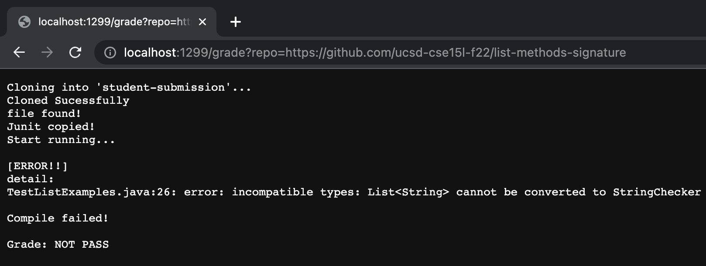
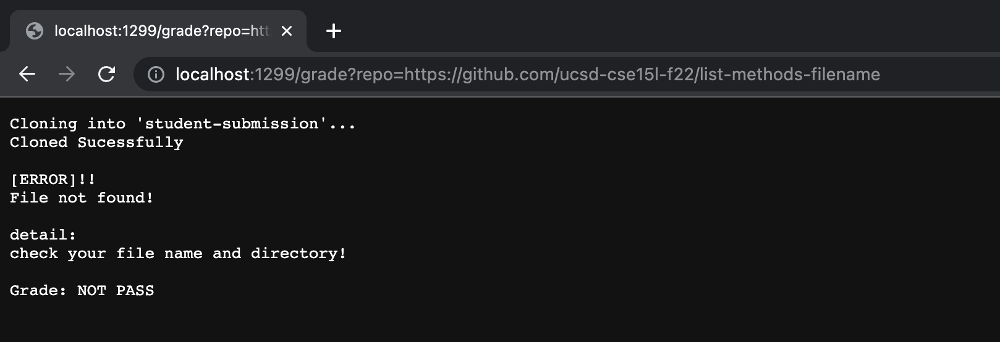
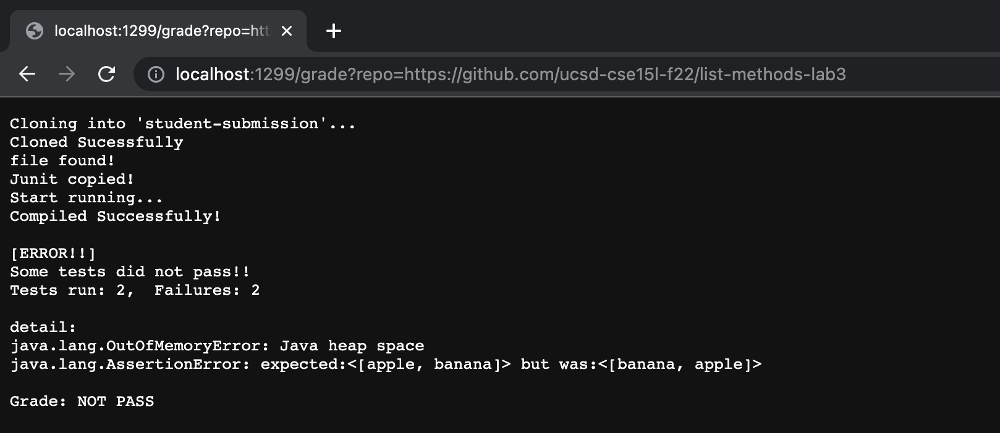

# Week 8 Lab report

## Code
```
# Create your grading script here
rm -rf student-submission
git clone $1 student-submission
if [ $? -eq 0 ]
then
    echo "Cloned Sucessfully"
else
    echo "Clone failed!"
    echo "Grade: NOT PASS"
    exit 1
fi
 
cd student-submission
 
if [ -f ListExamples.java ]
then
    echo "file found!"
else
    echo " "
    echo "[ERROR]!!"
    echo "File not found!"
    echo " "
    echo "detail:"
    echo "check your file name and directory!"
    echo " "
    echo "Grade: NOT PASS"
    exit 1
fi
 
cd ..
cp -r lib student-submission/
echo "Junit copied!"
 
cp TestListExamples.java student-submission/
cd student-submission
echo "Start running..."

 
javac -cp .:../lib/hamcrest-core-1.3.jar:../lib/junit-4.13.2.jar *.java 2> compileError1.txt
if [ $? -eq 0 ]
then
    echo "Compiled Successfully!"
else
    echo " "
    echo "[ERROR!!]"
    echo "detail:"
    cat compileError1.txt | grep "error:" 
    echo " "
    echo "Compile failed!"
    echo " "
    echo "Grade: NOT PASS"
    exit 1
fi
 
 
java -cp .:../lib/hamcrest-core-1.3.jar:../lib/junit-4.13.2.jar org.junit.runner.JUnitCore TestListExamples > compileError2.txt
if [ $? -eq 0 ]
then
    echo "All tests run well!!"
    echo "Grade: PASS"
    exit 1
else  
    echo " "
    echo "[ERROR!!]"
    echo "Some tests did not pass!!"
    cat compileError2.txt | grep "Tests run:"
    echo " "
    echo "detail: " 
    cat compileError2.txt | grep "Error:"
    echo " "
    echo "Grade: NOT PASS"
    exit 1
fi
```
## screenshots for three different students' submission

* **First student's submission:**
[First Link](https://github.com/ucsd-cse15l-f22/list-methods-signature)


---
* **Second student's submission:**
[Second Link](https://github.com/ucsd-cse15l-f22/list-methods-filename)


---
* **Third student's submission:**
[Third Link](https://github.com/ucsd-cse15l-f22/list-methods-lab3)


## Trace of `grade.sh`
The following is for calling the `http://localhost:1299/grade?repo=https://github.com/ucsd-cse15l-f22/list-methods-signature`!!

```
# Create your grading script here
rm -rf student-submission                       # return code: 0
git clone $1 student-submission                 # return code: 0
if [ $? -eq 0 ]                                 # it is true since the last exit code is 0
then
    echo "Cloned Sucessfully"                   # standard output is "Cloned Sucessfully"      
else                                            
    echo "Clone failed!"                        # does not run
    echo "Grade: NOT PASS"                      # does not run
    exit 1                                      # does not run
fi                                              # end of if statment 
 
cd student-submission                           # return code: 0
 
if [ -f ListExamples.java ]                     # it is true since ListExamples.java is found under student-submission
then                                            
    echo "file found!"                          # standard output is "file found!""
else                            
    echo " "                                    # does not run
    echo "[ERROR]!!"                            # does not run
    echo "File not found!"                      # does not run
    echo " "                                    # does not run
    echo "detail:"                              # does not run
    echo "check your file name and directory!"  # does not run
    echo " "                                    # does not run
    echo "Grade: NOT PASS"                      # does not run
    exit 1                                      # does not run
fi                                              # end of if statement
 
cd ..                                           # return code: 0
cp -r lib student-submission/                   # return code: 0            
echo "Junit copied!"                            # standard output is "Junit copied!" 
 
cp TestListExamples.java student-submission/    # return code: 0
cd student-submission                           # return code: 0
echo "Start running..."                         # standard output is "Start running..."                   

 
javac -cp .:../lib/hamcrest-core-1.3.jar:../lib/junit-4.13.2.jar *.java 2> compileError1.txt 
                                                # return code: 1 
                                                # and standard error will be input into compileError file
                                                
if [ $? -eq 0 ]                                 # it is false since the last exit code is 1
then                                            
    echo "Compiled Successfully!"               # does not run
else                                            
    echo " "                                    # standard output is " " as a new line 
    echo "[ERROR!!]"                            # standard output is "[ERROR!!]"    
    echo "detail:"                              # standard output is "detail:"     
    cat compileError1.txt | grep "error:"       # return code: 0 and standard output is "error:"   
    echo " "                                    # standard output is " " as a new line 
    echo "Compile failed!"                      # standard output is "Compile failed!" 
    echo " "                                    # standard output is " " as a new line 
    echo "Grade: NOT PASS"                      # standard output is "Grade: NOT PASS"      
    exit 1                                      # early exit
fi                                            
 
 
java -cp .:../lib/hamcrest-core-1.3.jar:../lib/junit-4.13.2.jar org.junit.runner.JUnitCore TestListExamples > compileError2.txt
                                                # does not run because of early exit
                                                
if [ $? -eq 0 ]                                 # does not run because of early exit 
then                                           
    echo "All tests run well!!"                 # does not run because of early exit
    echo "Grade: PASS"                          # does not run because of early exit
    exit 1                                      # does not run because of early exit
else  
    echo " "                                    # does not run because of early exit
    echo "[ERROR!!]"                            # does not run because of early exit
    echo "Some tests did not pass!!"            # does not run because of early exit
    cat compileError2.txt | grep "Tests run:"   # does not run because of early exit
    echo " "                                    # does not run because of early exit
    echo "detail: "                             # does not run because of early exit
    cat compileError2.txt | grep "Error:"       # does not run because of early exit
    echo " "                                    # does not run because of early exit
    echo "Grade: NOT PASS"                      # does not run because of early exit
    exit 1                                      # does not run because of early exit
fi                                              # does not run because of early exit
 
```
