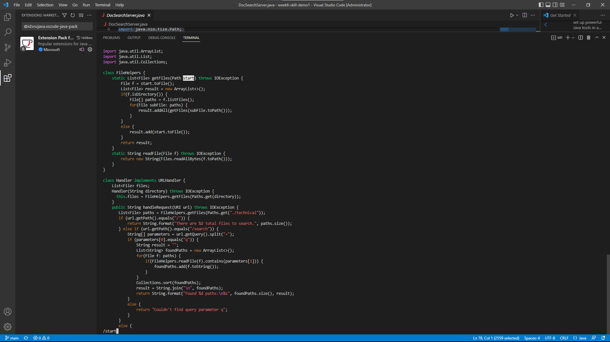
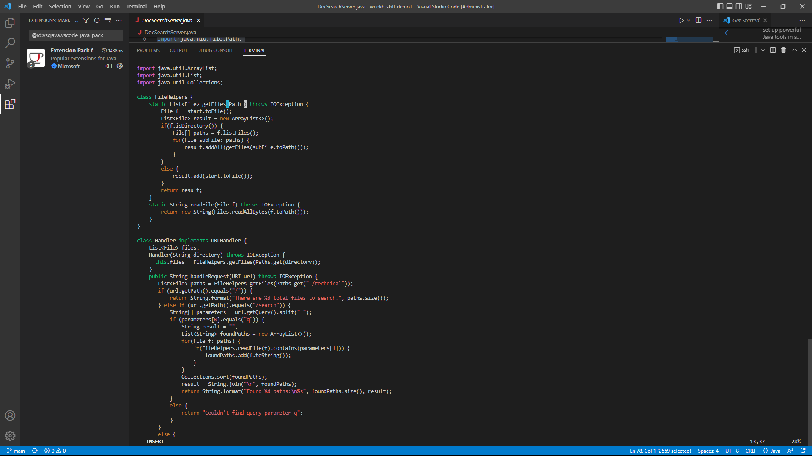
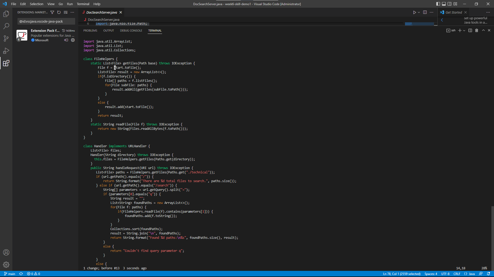
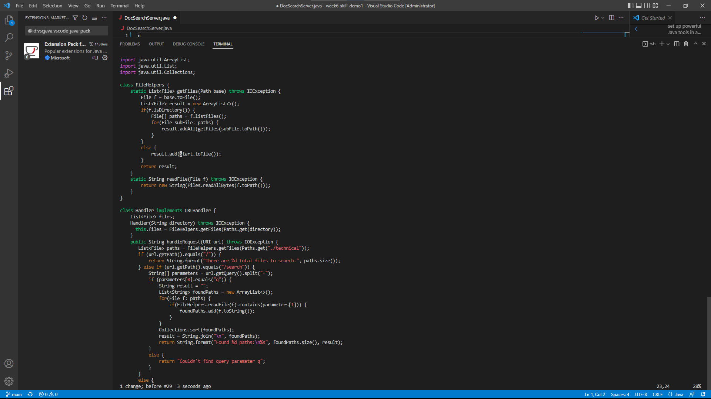
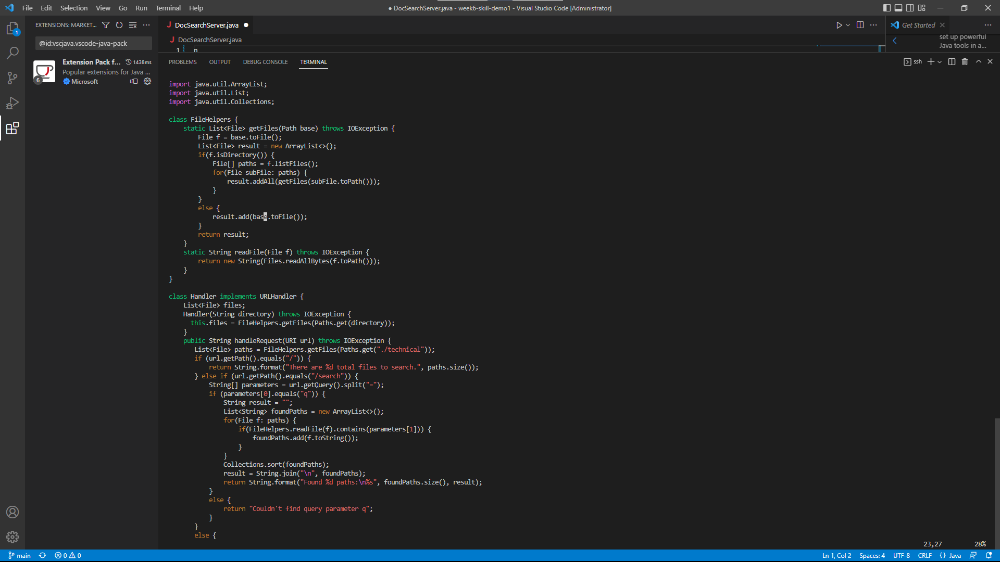
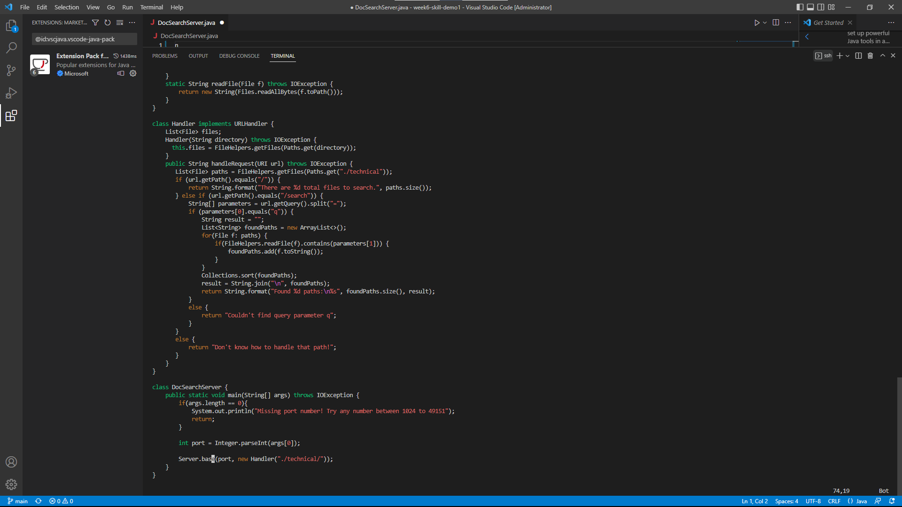
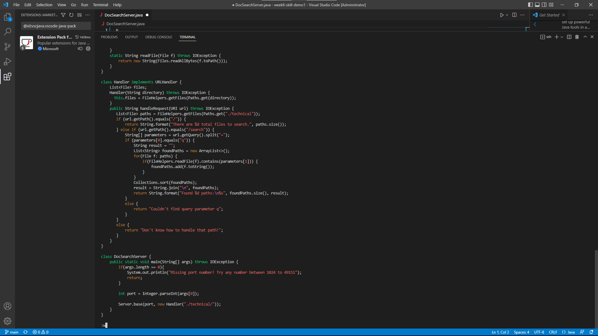
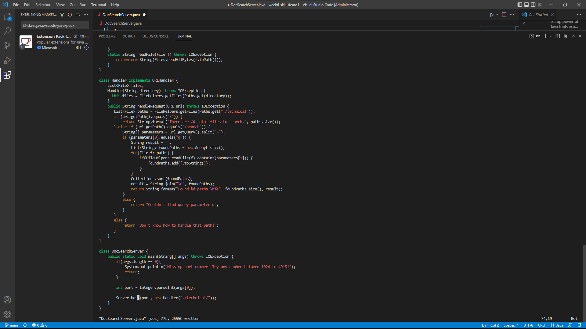

# Using vim to edit
---
## Part 1

**Task:**

*using **vim** to give the shortest sequence of commands*

*for approaching changing the name of the 'start' parameter and its uses to 'base'*

   **p.s: file is "DocSearchServer.java" from week6**
   
**command:**

`/start<Enter>cgn<Esc>n.n.n.:w<Enter>`

---
**procedure:**

screenshot of typing `/start`. Vim will choose the matching the first `start`

screenshoot of typing `<Enter>`. Cursor will jump to the start of the first `start`

screenshoot of typing `cgn`. It helps us find the last thing we searched for, which is `start`, then delete it, and then put us into insert mode.

screenshoot of typing `base`. The previous step put us into insert mode so that we type in `base` to change the parameter.

screenshoot of typing `n`. We will go to the next thing we searched for before.(the second one)

screenshoot of typing `.` replacing the `start` by the action we did before. This command help us repeat the command action we did.

screenshoot of typing `n`. We will go to the next thing we searched for before.(the third one)

screenshoot of typing `.` replacing the `start` by the action we did before. This command help us repeat the command action we did.

screenshoot of typing `n.`. We will go to the next thing we searched for before and repeat the replacing.(the forth one)

screenshoot of typing `:w`,saving the changes

screenshoot of saved screen.

---

## Part 2

**Task:**
count the time of local edition and server edition and answer questions

time for local edition: **2 m 12 s**

time for server edition: **52 s**

>detail: 

1. for the first one, I have to prepare the account number and make sure that my working computer has genkey to skip the typing password step
2. for the first one, scp command is a long one since I have to add the filename, my account and the  location on the server, whcih cost a lot time
3. for the second one, only the final step of typing `:wq` which is not presented as above. 

>Answer for quetions:

**Which of these two styles would you prefer using if you had to work on a program that you were running remotely, and why?**

I would prefer the vim type. It is much faster and takes less step to replace. Howwever, the first one, I have to do each change and upload it. If it has error, I will have to re-upload it again. The login in process also takes time.

**What about the project or task might factor into your decision one way or another? (If nothing would affect your decision, say so and why!)**

the difficulty and the length of the project. If the project is very long and I will need to type all coding on my own, I would choose do it locally. I can try it on locally and make sure each test is working and then upload. Since to run the code localling is faster than running coding on server, I would not choose using vim on my server to do my project if the project is hard and long. However, if the project is not quite complicated and long. The only task I need is to change some things, do it on server with vim would be a better choice.
